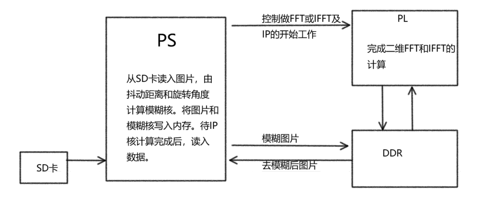

# 2020年新工科联盟-Xilinx暑期学校（Summer School）项目

# 项目概述
  本项目可以做到拍照时抖动模糊照片的去模糊功能，具体采用图像处理找到图像的抖动距离和旋转角度，转换为模糊核，通过维纳滤波器来达到去模糊效果。设计采用soc设计，其中PL端应用xilinx_hls工具设计了图像二维卷积的IP来加速计算，其他部分在PL端计算。本设计可以应用无人机或传统监控中的抖动模糊去除。

# 工具版本
1.vivado 2018.3

2.vivado hls 2018.3

3.python 3.7

# 硬件平台
pynq-z2

# 系统框图

